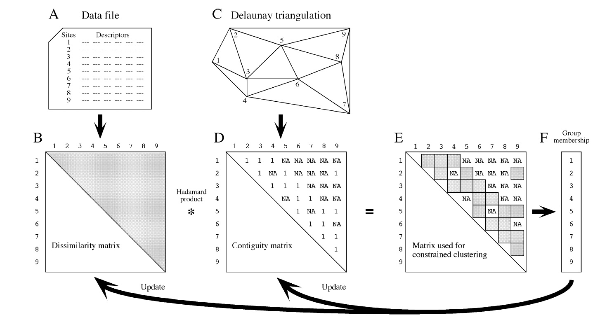
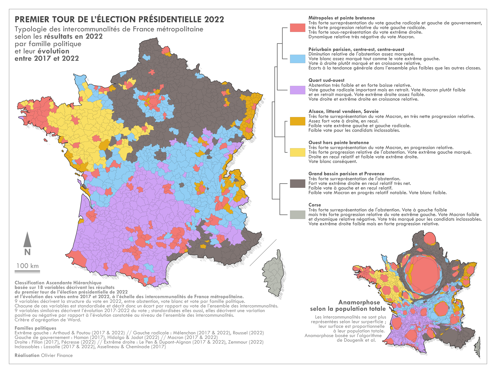

> La combinaison des méthodes de classification et de régionalisation est facilitée par le développement d'une nouvelle fonction du package **adespatial** qui permet de regrouper les unités spatiales les plus ressemblantes en respectant la contrainte de connexité. Mis au point par des écologues canadien, cette méthode de classification ascendante hiérarchique avec contrainte de contiguïté est beaucoup plus simple d'emploi et beaucoup plus efficace que les autres méthodes de régionalisation disponible actuellement dans le package Rgeoda. Elle s'appuie sur un corpus théorique d'analyse spatiale de la biodiversité des espaces animales ou végétales que l'on peut transposer à de nombreux problèmes géographiques. Nous prenons ici comme exemple l'analyse du résultat des élections européennes de 2024 en France à trois niveaux d'agrégation : régions adminisratives , départements et circonscriptions législatives. 


```{r setup,  echo=TRUE}

## Global options
knitr::opts_chunk$set(echo=TRUE,
        	            cache=FALSE,
                      prompt=FALSE,
                      comment=NA,
                      message=FALSE,
                      warning=FALSE,
                      class.source="bg-info",
                      class.output="bg-warning")

# Packages d'affichage
library(knitr)
library(gt)

# Packages utilitaires
library(readxl)
library(dplyr)
library(reshape2)

# packages graphiques
library(ggplot2)
library(ggrepel)

# Packages cartographiques
library(sf)
library(mapsf)
library(RColorBrewer)
library(cartography)

# Packages statistique 
library(ineq)
library(stargazer)
library(spdep)
library(adespatial)

```


# Introduction {.unnumbered}

Les géographes français qui sont confrontés à l'analyse d'un ensemble de variables décrivant un ensemble de lieux vont le plus souvent procéder à une analyse en deux étapes combinant analyse factorielle et classification ascendante hiérarchique (CAH). Si les variables sont hétérogènes (différentes unités de mesure) ils utiliseront une analyse en composantes principales sur le tableau des variables standardisées suivi d'une CAH en métrique euclidienne. Si les variables forment un tableau de contingence, il pourront appliquer les méthode précédentes sur un tableau de profils en ligne (standardisés ou non) ou bien opter pour le couplage entre analyse factorielle des correspondances et classification ascendante hiérarchique en métrique du chi-2. Ces approches qui s'inscrivent dans la tradition de l'analyse des données "*à la française*" ont été formalisées initialement par les travaux de @benzecri1973, puis popularisés en géographie par l'ouvrage de @sanders1989 et finalement mis à la disposition d'un large public grâce à l'excellent package FactomineR [@lê2008] et les publications de ses auteurs, notamment @husson2016. Les avantages du couplage entre les deux approches sont évidents puisque les méthodes factorielles permettent d'analyser d'abord les corrélations entre les colonnes du tableaux avant de procéder au regroupement des lignes à l'aide de la CAH [@husson2010].

Sans remettre en cause l'intérêt de ces approches, nous souhaiterions proposer ici une autre forme de couplage de méthodes statistiques associant **classification** et **régionalisation**, issue des travaux des écologues qui s'intéressent aux associations spatiales de plantes ou d'animaux et cherchent à en mesurer l'abondance, la spécialisation et la diffusion [@legendre1989, @legendre2013]. Si le point de départ est le même (tableau croisant des lieux décrits par un ensemble de variables), les analyses vont ici surtout porter sur des tableaux homogènes décrivant soit l'abondance de différentes espèces (tableau de contingence), soit leur présence/absence (tableau disjonctif complet). Et surtout elles vont ajouter un élément supplémentaire sous la forme d'une matrice de proximité décrivant généralement la contiguïté des lieux sous la forme d'un **graphe de voisinage**.  La procédure de régionalisation mise au point récemment avec la fonction `constr.hclust()`du package **adespatial** suit le schéma suivant  [@guénard2022] :

```{r, echo=FALSE, out.width="80%",  fig.align = 'center', fig.caption = 'Algorithme de régionalisation (Guénard & Legendre, 2022 )'}

```

Il s'agit donc d'une méthode de classification ascendante hiérarchique comparable à celles qui sont utilisées dans R-Base (fonction `hclust`) ou dans FactoMineR (fonction `HCPC`) mais avec deux différences importantes. D'une part, l'ajout de la contrainte de contiguïté limite les possibilités de fusion des unités spatiales. D'autre part, il est possible d'utiliser un grand nombre de fonctions de dissimilarités en entrée, sans se limiter à celles qui sont privilégiées par les méthodes d'analyse factorielle à la française. Les écologues considèrent en effet que la distance euclidienne (normée ou non) et la distance du chi-2 ne sont pas toujours les plus pertinentes pour mesurer les ressemblances entre lieux, surtout si l'on considère leur caractère généralement non gaussien. 

L'objectif du présent article R-Zine est de discuter l'intérêt de cette procédure pour l'analyse géographique de tableaux de contingence dont les lignes sont des lieux et les colonnes des attributs dont la somme en ligne a un sens. Nous avons retenu comme exemple d'application les résultats des élections européennes de 2024 en examinant les résultats à trois niveaux d'agrégation : les régions administratives, les départements et les circonscriptions législatives (Cf. Annexe). Pour éviter une répétition, chaque niveau d'analyse sera dédié à un aspect différent du problème général de comparaison des approches de régionalisation et de classification : 

- **L'échelle régionale** sera utilisé pour rappeler les principes de base des méthodes de classification et de régionalisation en insistant sur le rôle déterminant du choix de la matrice de dissimilarité utilisée en entrée.

- **L'échelle départementale** constituera le niveau privilégié de comparaison des résultats des méthodes de classification et de régionalisation afin de voir leurs apports respectifs à la compréhension du phénomène.

- **L'échelle des ciconcriptions** permettra d'examiner l'intérêt d'une approche multiscalaire et de souligner les difficultés de la régionalisation lorsque le phénomène change de nature en fonction du niveau d'agrégation. 


# ECHELLE REGIONALE : PRINCIPES DE BASE

Afin de bien comprendre la différence entre classification et régionalisation et l'importance de la pondération, nous allons commencer par un exemple très simple portant sur la distribution des votes pour les deux principales listes d'extrême droite dans les 12 régions de France Métropolitaine.

## Présentation des données

On calcule le pourcentage de suffrages exprimés pour les listes conduites par Jordan Bardella (liste n°5 , RN) et Marion Maréchal (liste n°3, Reconquête) à l'échelle des 12 régions de France Métropolitaine (hors Corse). On obtient le tableau suivant :

```{r}
don <-readRDS("data/net/don_regi.RDS") %>%
       mutate(Bardella = 100*vot5/exp,
              Marechal = 100*vot3/exp) %>%
       select(regi, regi_nom, Bardella, Marechal) %>% 
  arrange(regi)
don$regi_code<-c("IDF","CVDL","BOFC","NORM","HDFR","GEST","PDLO","BRET",
                 "NAQU","OCCI","AURA","PACA")
don<-don[,c(1,5,2,3,4)]
kable(don, caption = "Part des suffrages exprimés pour les listes Bardella et Marechal aux élections européennes de 2024  par région", digits = 1)
```

### Paramètres principaux

L'examen des paramètres statistiques des deux listes est effectué à l'intérieur des 12 régions étudiées en excluant la Corse et les DROM. Les valeurs sont donc légèrement différentes des résultats obtenus pour la France entière.

```{r}
min<-apply(don[,4:5],2,min)
max<-apply(don[,4:5],2,max)
moy<-apply(don[,4:5],2,mean)
ect<-apply(don[,4:5],2,sd)
var<-ect**2
cv<-100*ect/moy
tab<-cbind(min,max,moy,ect,var,cv)
row.names(tab)<-c("Bardella","Marechal")
kable(tab,
      caption = "Paramètres principaux des deux listes ", 
      col.names = c("minimum", "maximum", "moyenne","écart-type","variance","coeff. variation (%)"),
        
      digits=1)
```

::: {.alert .alert-success role="alert"}
**Commentaire** : La liste Bardella obtient une moyenne (non pondérée) de 32.9% dans les 12 régions avec des scores allant de 18.8% en Ile-de-France à 42.7% dans les Hauts-de-France. La liste Maréchal affiche quant à elle des scores de 4.2% en Bretagne à 7.7% en PACA avec une moyenne de 5.3%. La variation absolue des résultat, mesurée par l'écart-type est logiquement beaucoup plus forte pour Bardella ($\sigma=6.5$) que pour Maréchal ($\sigma=0.9$). Mais les variations relatives mesurées par le coefficient de variation (rapport entre l'écart-type et la moyenne) sont assez voisines avec 19.9% pour Bardella et 16.7% pour Maréchal.
:::

### Distribution spatiale

On cartographie la distribution des deux variables en quatre classes à l'aide de la méthode des quantiles (soit trois régions par classe) et on examine la forme des histogrammes correspondant.

```{r Exemple1, fig.width=7, fig.height=8}
## Charge le fonds de carte
map<-readRDS("data/net/map_regi.RDS")

## effectue la jointure
mapdon<-left_join(map,don)

## Cartographie
par(mfrow=c(2,2), cex.main=0.8)
mf_map(mapdon, 
       type="choro", 
       var="Bardella", 
       nbreaks = 4,
       method = "quantile",
       leg_title = "en %", 
       leg_val_rnd = 1)
mf_layout("Vote Bardella", frame=T, credits = "", arrow=F)
mf_map(mapdon, 
       type="choro", 
       var="Marechal", 
       nbreaks = 4,
       method = "quantile",
       leg_title = "en %", 
       leg_val_rnd = 1)
mf_layout("Vote Marechal", frame=T, credits = "", arrow=F)

mf_distr(don$Bardella, nbins=4, bw=sd(don$Bardella))
mf_distr(don$Marechal, nbins=4,bw = sd(don$Marechal))

```

::: {.alert .alert-success role="alert"}
**Commentaire** : la distribution des votes Bardella est légèrement dissymétrique à droite avec une valeur exceptionellement faible correspondant à l'Ile-de-France. La distribution de Maréchal est au contraire dissymétrique à gauche avec une valeur exceptionnellement forte correspondant à la région PACA. La comparaison des deux distributions spatiales ne semble pas révéler à première vue de corrélation positive ou négative ce qui est confirmé par les coefficients de Pearson ($r=0.20, p =0.53$) ou de Spearman ($\rho =+0.03, p=0.94$)
:::

## Matrices de dissimilarité

En amont d'une classification ou d'une régionalisation, la création d'une matrice de dissimlilarité entre les unités spatiales est une étape essentielle qui conditionne la suite des analyses. Deux choix essentiels interviennet alors :

-   le choix d'une transformation ou non des indicateurs
-   le choix d'une métrique

### Espace des variables brutes

La variance des scores de la variable X1 (Bardella) est beaucoup plus forte que celle de la variable X2 (Marechal), ce qui signifie que si l'on s'en tient aux variables brutes, les différences entre régions seront liées essentiellement aux variations de la liste X1. Les différentes unités spatiales se positionneront alors dans un espace de la forme suivante :

```{r}
plot(don$Bardella,don$Marechal,
     asp=1,
     xlab = "Score Bardella en % (X1)",
     ylab = "Score Marechal en % (X2)",
     main = "Distances dans l'espace des variables brutes",
     pch=20)
text(don$Bardella,don$Marechal,don$regi_code, pos=3, cex=0.8, col="red")
grid()
```

::: {.alert .alert-success role="alert"}
**Commentaire** : sur la figure ci-dessus on a pris soin de construire deux axes orthonormées où une différence d'un point de pourcentage correspond à la même distance horizontalement et verticalement. Il est donc logique que la figure soit beaucoup plus étendue dans le sens horizontal que dans le sens vertical puisque le vote Bardella crée plus de différences entre les régions en valeur absolue que le vote Maréchal
:::

On voit visuellement sur la figure précédente que les points représentant les unités spatiales sont plus ou moins éloignés, la distance qui les sépare étant une mesure de leur dissimilarité en matière de vote pour les deux listes considérées. Deux mesures de distances peuvent alors classiquement être utilisées pour convertir les positions en matrice de distance, la distance euclidienne ($D^{Euc}$) et la distance de Manhattan ($D^{Man}$).

-   $D^{Euc}(i,j) = \sqrt{\sum_{k=1}^K (X_{ik}-X_{jk})^2}$

-   $D^{Man}(i,j) = \sum_{k=1}^K |X_{ik}-X_{jk}|$

Les deux solutions donnant des résultats assez voisins on se limitera ici à l'analyse de la matrice des distances euclidiennes.

```{r}
DS_eucl <-as.matrix(dist(don[,4:5],method = "euclidean", upper=T,diag =F))
colnames(DS_eucl)<-don$regi_code
rownames(DS_eucl)<-don$regi_code
#kable(DS_eucl, digits=2, caption = "Dissimilarité en distance euclidienne brute")
tabres<-data.frame(DS_eucl)
tabres  %>% gt(rownames_to_stub = T) %>% 
  tab_header(
    title = md("**Dissimilarité en distance euclidienne brute**")
  ) %>% 
  fmt_number(
    decimals = 1)
```

::: {.alert .alert-success role="alert"}
**Commentaire** : La plus forte dissimilarité est observée entre la région Ile-de-France (IDF) et la région Hauts-de-France (HDFR) et la plus faible entre les régions Centre Val de Loire (CVDL) et Normandie (NORM). En comparant la matrice de dissimilarité au graphique orthonormé précédent, on comprend que les différences entre unités spatiales sont essentiellement produites par les variations du vote Bardella qui possède une plus forte variance que le vote Maréchal. Ce dernier n'introduit que des différenciations secondraires.
:::

### Espace des variables standardisées

Si le choix de la métrique euclidienne ou de la métrique de Manhattan introduit peu de différences dans les matrices de dissimilarité, il en va tout autrement de la standardisation des variables qui consiste à ramener chaque indicateur à une même moyenne ($\mu = 0$) et surtout un même écart-type ($\sigma = 1$).

$X^*_i = \frac{X_i - \mu_X}{\sigma_X}$

Pour bien apprécier la différence, onpeut commencer par visualiser les distances (donc les dissimilarités) dans l'espace des variables standardisées en adoptant comme précédemment un repère orthonormé mais dont l'unité de mesure est l'écart-type et non plus les points de pourcentage :

```{r}
# Standardise les deux variables
don$Bardella_std <- as.numeric(scale(don$Bardella))
don$Marechal_std <- as.numeric(scale (don$Marechal))

plot(don$Bardella_std,don$Marechal_std,
     asp=1,
     xlab = "Score Bardella standardisé (X1)",
     xlim=c(-2.5,2.5),
    ylim=c(-1.5,3),
     ylab = "Score Marechal standardisé (X2)",
     main = "Distances dans l'espace des variables standardisées",
     pch=20)
text(don$Bardella_std,don$Marechal_std,don$regi_code, pos=2, cex=0.8, col="red")
grid()
```

Les distances euclidiennes dans ce nouvel espace des variables standardisées sont évidemment différentes de celles que l'on avait obtenu dans l'espace des variables brutes.

```{r}
DS_eucl_std <-as.matrix(dist(don[,6:7],method = "euclidean", upper=T,diag =F))
colnames(DS_eucl_std)<-don$regi_code
rownames(DS_eucl_std)<-don$regi_code
#kable(DS_eucl, digits=2, caption = "Dissimilarité en distance euclidienne standardisée")
tabres<-data.frame(DS_eucl_std)
tabres  %>% gt(rownames_to_stub = T) %>% 
  tab_header(
    title = md("**Dissimilarité en distance euclidienne standardisée**")
  ) %>% 
  fmt_number(
    decimals = 1)
```

::: {.alert .alert-success role="alert"}
**Commentaire** : Par rapport à la représentation dans l'espace non-standardisé il y a désormais un étirement comparable du nuage de point dans les deux directions de l'espace standardisé. Ce résultat est logique puisque les écart-types sont désormais égaux pour les deux candidats ce qui signifie que les différences liées au vote Maréchal vont jouer le même rôle que celles liées au vote Bardella. Les deux unités spatiales les plus différentes ne sont plus l'Ile-de-France (IDF) et les Hauts-de-France (HDFR) mais la Bretagne (BRET) et la région Provence-Alpes-Côte d'Azur (PACA). Ce que l'on peut facilement vérifier en calculant la distance euclidienne sur variables standardisées.
:::

### Espace des variables ordinales

On pourrait transformer nos deux variables $X_1$ et $X_2$ en rang pour en faire des distributions uniformes insensibles au jeu des valeurs exceptionnelles. Si l'on effectue une transformation en rang, la géométrie de l'espace devient celle d'une grille de 12 x 12 positions en fonction des rangs obtenus par les unités spatiales pour le vote Bardella ou le vote Maréchal. Dans cet espace discret (sauf en cas de valeurs ex aequo) il semble logique d'utiliser la somme des différences de rang en valeur absolue, c'est-à-dire la distance de Manhattan sur les variables transformées. Cette distance correspond au plus court chemin en suivant la grille qui croise les rangs de X1 et X2 :

```{r}
don$Bardella_rnk <- rank(-don$Bardella)
don$Marechal_rnk <- rank(-don$Marechal)

plot(don$Bardella_rnk,don$Marechal_rnk,
     asp=1,
     xlab = "Rang pour le score Bardella (X1)",
    frame = F,
    axes =T,
    xlim=c(1,12),
    ylim=c(1,12),
     ylab = "Rang pour le score Marechal (X2)",
     main = "Distances dans l'espace des rangs",
     pch=20)
text(don$Bardella_rnk,don$Marechal_rnk,don$regi_code, pos=2, cex=0.8, col="red")
abline(v=1:12, lty=1, lwd=0.5)
abline(h=1:12, lty=1, lwd=0.5)
```

```{r}
DS_Man_rnk <-as.matrix(dist(don[,8:9],method = "manhattan", upper=T,diag =F))
colnames(DS_Man_rnk)<-don$regi_code
rownames(DS_Man_rnk)<-don$regi_code
#kable(DS_eucl, digits=2, caption = "Dissimilarité en distance euclidienne standardisée")
tabres<-data.frame(DS_Man_rnk)
tabres  %>% gt(rownames_to_stub = T) %>% 
  tab_header(
    title = md("**Dissimilarité de Manhattan sur les rangs**")
  ) %>% 
  fmt_number(
    decimals = 0)
```

::: {.alert .alert-success role="alert"}
**Commentaire** : On trouve désormais une distance maximale de 20 qui place à égalité la paire IDF-HDFR (plus forte distance euclidienne brute) que la paire BRET-PACA (plus forte distance euclidienne standardisée) Cette troisième solution offre donc ici une sorte de compromis entre les deux précédentes, même si elle est en réalité plus proche de la méthode standardisée que de la méthode brute.
:::

Il existe de nombreuses autres solutions permettant de transformer le petit tableau de données en d'autres matrices de dissimilarité tout aussi légitimes que les trois présentées ci-dessus. On pourrait par exemple utiliser une autre métrique telle que distance de Tchebychev qui est la magnitude absolue maximale des différences entre les coordonnées des points.

Le point important à retenir avant de passer à la suite des analyses est que **le choix de la matrice de dissimilarité exerce une influence cruciale sur les résultats des méthodes de classification ou de régionalisation qui vont être mise en oeuvre**. Or, ce choix est trop souvent implicite dans les logiciels de statistiques qui proposent par défaut des méthodes fondées sur la **variance** c'est-à-dire sur le **carré des distances euclidiennes standardisées**. Ce choix est le plus souvent justifié car il évite aux débutants en statistique des erreurs fatales telles que le fait de ne pas standardiser un jeu de variables hétérogènes ayant des unités de mesure et des ordres de grandeur différents. Mais il peut aussi aboutir à des résultats discutables ou du moins pas forcément les plus adaptés à la problématique.

## Classification

### Choix du critère à optimiser

Les méthodes de classification et de régionalisation ascendante hiérarchiques ont pour point commun d'opérer un regroupement des unités spatiales en allant des plus ressemblantes au moins ressemblantes. Elles fournissent un arbre de regroupement qui permet de visualiser chaque étape du regroupement et des critères permettant d'opérer un compromis entre l'homogénéité interne des classes ou régions et leur nombre.

Une bonne classification (ou une bonne régionalisation) devra comporter le moins de classes ou régions pour offrir un bon résumé. Mais également un nombre suffisant pour éviter de constituer des ensembles trop hétérogène. On utilise souvent la part de variance expliquée par la partition pour mesurer cette qualité. Mais ce choix conduit à imposer une métrique (distance euclidienne) et un algorithme (critère de Ward). Il est plus intéressant de prendre un critère plus général fonde sur le rapport entre les dissimilarité internes et externes des entités constituées. Si on s'en tient à la définition de classes ou régions homogènes comme des **groupes d'unités spatiales qui se ressemblent plus entre elles qu'elles ne ressemblent aux unités spatiales des autres groupes**, alors notre critère à optimiser $H$ prendra une des formes suivantes :

$H = \frac{Dissimilarité \space inter \space groupe}{Dissimilarité \space intra \space groupe}$

ou

$H = \frac{Dissimilarité \space inter \space groupe}{Dissimilarité \space totale}$

ou

$H =  1- \frac{Dissimilarité \space intra \space groupe}{Dissimilarité \space totale}$

### Choix de l'algorithme de regroupement

Une classification ascendante hiérarchique peut s'opérer selon différents algorithmes qui correspondent à différents critères d'optimisation Le critère qui semble intuitivement le plus simpleest la minimisation des **distances moyennes** intra-classes et la maximisation des **distances moyennes** inter-classes. Cette méthode du *average linkage* est la plus simple à comprendre. Mais il existe beaucoup d'autres algorithmes cherchant par exemple à minimiser les distances minimales (*single linkage*) , les distance maximales (*complete linkage*), les distances médianes, etc... La méthode par défaut de la plupart des logiciels de statistiques est appelée méthode de *Ward* qui consiste à minimiser la somme des distances entre les centres de gravité des classes ce qui la place l'analyse dans le cadre de l'analyse de la variance [@ward1963].Cette méthode comporte toutefois des variantes qui produisent des résultats différentes comme cela a été démontré par @murtagh2014 et on distingue en pratique deux méthodes *Ward.D* et *Ward.D2* qui s'appliquent à des distances simples ou des distances élevées au carré.

Pour assurer une bonne comparabilité des résultats de classification et de régionalisation, nous utiliserons ici la fonction R-base **hclust()** (*hierarchical clustering*) plutôt que la fonction **HCPC()** du package *FactoMineR* qui est plus puissante mais introduit souvent des modifications de l'algorithme de base à l'insu de l'utilisateur non averti (notamment le fait d'optimiser a posteriori les classes par une méthode de type k-means). La régionalisation sera faite à l'aide de la fonction **constr.clust()** du package *adespatial* qui reproduit fidèlement la méthode de la fonction *hclust()* en y ajoutant simplement une contrainte de contiguïté des unités regroupées. Pour plus de détail on se reportera à la description de la classification avec contrainte de contiguïté dans @guénard2022.

### Comparaison des classifications

Nous allons examiner les résultats des classifications opérées sur les matrices de dissimilarité en distance euclidienne sur variables standardisées ou non standardisées et en distance de Manhtattan sur variables ordinales avec la même méthode *Ward.D*. Nous examinerons également dans chaque cas la distribution géographique des résultats pour une partition en trois classes afin de voir si les classes obtenues correspondent ou non à une régionalisation de la France

```{r, fig.width=6, fig.height=9}
par(mfrow=c(3,2), mar=c(2,4,3,0))

# Euclidienne non standardisée
cah_euc<-hclust(dist(DS_eucl), method = "ward.D")
plot(cah_euc,
     hang = -1, 
     cex=0.8,
     cex.main = 1,
     main="Distance euclidienne brute", 
     ylab="Dissimilarité",
     sub=NA,xlab="")

clas<-as.factor(cutree(cah_euc, k=3))
map$clas<-clas
mf_map(map, type="typo",var="clas")
mf_layout("Partition en 3 classes", frame=T, arrow=F,credits="")

# Euclidienne standardisée
cah_euc_std<-hclust(dist(DS_eucl_std), method = "ward.D")
plot(cah_euc_std,
     hang = -1, 
     cex=0.8,
     cex.main = 1,
     main="Distance euclidienne standardisée", 
     ylab="Dissimilarité",
     sub=NA,xlab="")

clas<-as.factor(cutree(cah_euc_std, k=3))
map$clas<-clas
mf_map(map, type="typo",var="clas")
mf_layout("Partition en  3 classes", frame=T, arrow=F,credits="")

# Manhattan ordinale
cah_man_rnk<-hclust(dist(DS_Man_rnk), method = "ward.D")
plot(cah_man_rnk,
     hang = -1, 
     cex=0.8,
     cex.main = 1,
     main="Distance ordinale de Manhatan", 
     ylab="Dissimilarité",
     sub=NA,xlab="")

clas<-as.factor(cutree(cah_man_rnk, k=3))
map$clas<-clas
mf_map(map, type="typo",var="clas")
mf_layout("Partition en  3 classes", frame=T, arrow=F,credits="")

```

::: {.alert .alert-success role="alert"}
Les trois classifications aboutissent logiquement à des regroupements différents puisqu'elles sont fondées sur des matrices de dissimilarité différentes. La région Ile-de-France ne se regroupe jamais avec les régions voisines car son score pour la liste Bardella est beaucoup plus faible et son score pour la liste Maréchal un peu plus élevé. Elle se regroupe fréquemment avec les régions de l'Ouest (Bretagne, Pays-de Loire, Aquitaine) qui se caractérisent par la faiblesse relative du vote d'extrême-droite. La région PACA se regroupe quant-à elle surtout avec sa voisine d'Occitanie avec laquelle elle partage une fort vote Bardella et Maréchal. Mais elle diffère trop de la région Auvergne-Rhône-Alpes pour former un regroupement avec les régions du Nord et de l'Est. Au total, **aucune des classifications n'aboutit à une régionalisation** c'est-dire à une division de la France en trois sous-ensembles connexes de régions voisines.
:::

## Régionalisation

La fonction `constr.hclust()` du package adespatial permet de réaliser une classification ascendante hiérarchique sous contrainte de contiguïté en suivant un algorithme strictement comparable à celui d'une classification. La seule différence réside dans le fait d'éliminer des solutions en interdisant le regroupement d'unités spatiales si elles ne sont pas voisines ou, plus précisément connexes.

### Graphe de proximité

Pour bien comprendre la différence entre classification et régionalisation, il est intéressant de visualiser cartographiquement les matrices de contiguïté associés à chacune des deux méthodes.

-   la **classification** fait appel implicitement à un *graphe complet* qui est non planaire et dans lequel toutes les fusions d'unités spatiales en classes sont autorisées, qu'elles soient voisines ou non, connexes ou non.

-   la **régionalisation** fait de son côté appel à un *graphe de contiguïté* qui est de type planaire et que l'on obtient - dans l'exemple présenté ici - en détectant les régions qui ont une frontière commune. Il est facile d'obtenir ce graphe en utilisant par exemple la fonction `poly2nb()` du package **spdep**.

```{r}
mapdon<-left_join(map,don)
## FULL LINKS
i<-rep(1:12,12)
j<-i[order(i)]
link0<-data.frame(i,j) 
link0$link<-1
matlink0<-dcast(link0, formula = i~j, value.var="link" )
colnames(matlink0)<-mapdon$regi_code
rownames(matlink0)<-mapdon$regi_code


## CONTIG LINKS
contig<-spdep::poly2nb(mapdon,row.names = mapdon$regi_code)
linky<-nb2mat(contig)
matlink1<-linky
matlink1[linky>0]<-1
colnames(matlink1)<-row.names(matlink1)
link1<-melt(matlink1) %>% filter(value>0) %>% select(i=Var1, j=Var2)


## CENTROID
mapctr<-st_centroid(mapdon)
ctr <- st_coordinates(mapctr)

par(mfrow=c(1,2))
## MAP FULL LINKS
mf_map(mapdon, type="base",col="lightyellow")
segments(ctr[link0[,1],1] ,ctr[link0[,1],2], ctr[link0[,2],1] ,ctr[link0[,2],2],
         col="red")
#mf_map(mapctr, type="base",pch=20,col="white", add=T, cex=5)
mf_label(mapctr, var="regi_code", col="blue",cex=0.9,halo = T,bg = "white")
mf_layout("Graphe complet", frame=T, , credits = "Grasland C., 2024")


## MAP CONTIG LINKS
mf_map(mapdon, type="base",col="lightyellow")
segments(ctr[link1[,1],1] ,ctr[link1[,1],2], ctr[link1[,2],1] ,ctr[link1[,2],2],
         col="red")
#mf_map(mapctr, type="base",pch=20,col="white", add=T, cex=5)
mf_label(mapctr, var="regi_code", col="blue",cex=0.9,halo = T,bg = "white")
mf_layout("Graphe de voisinage", frame=T, credits = "Grasland C., 2024")
```

::: {.alert .alert-success role="alert"}
Dans les analyses de classification précédents, aucune contrainte de contiguïté spatiale n'était introduite et l'on pouvait par exemple fusionner dans une même classe la Bretagne et l'Ile-de-France qui ont des profils similaires en matière de faible vote pour les listes d'extrême-droite. Dans une analyse de régionalisation, il n'est plus possible de réunir ces deux unités spatiales sauf si on y ajoute d'autres régions les reliant telles que la Normandie ou les Pays de Loire et le Centre Val de Loire. On peut donc dire qu'**une régionalisation est une classification avec contraintes de proximité spatiale** ou, inversement, qu'**une classification est une régionalisation sans contraintes de proximité spatiale**.
:::

Il découle de ce qui précède une conséquence fondamentale qui est le fait qu'**une régionalisation suppose un double choix en ce qui concerne la matrice de dissimilarité, d'une part, et la matrice de proximité d'autre part**. Or, si le choix de la contiguïté administrative paraît évident dans le cas étudié ici, d'autres solutions seraient possibles pour établir un graphe de proximité aboutissant à d'autres formes de régionalisation. On peut en donner rapidement deux exemples.

-   Une **triangulation de Delaunay** pourrait par exemple être établie entre les centres des unités spatiales, qui aboutirait également à un graphe planaire mais ne respecterait pas forcémentn le critère de présence d'une frontière commune. On peut la réaliser facilement avec la fonction `tri2nb()` du package spdep.
-   La **méthode des k plus proches voisins** pourrait également servir à déterminer pour chaque unité spatiale les k plus proches en prenant comme critère la distance à vol d'oiseau entre leurs centres. On réalise facilement le graphe à l'aide des fonctions `knearneigh()` et `knn()` du package spdep. On obtient alors un graphe non planaire mais où chaque unité spatial aurait des nombres de voisins plus proches que dans le cas du graphe de contiguïté (mais pas forcément égal).

```{r}

## VORONOI
x<-tri2nb(coords = st_coordinates(st_centroid(mapdon)))
linky<-nb2mat(x)
matlink2<-linky
matlink2[linky>0]<-1
colnames(matlink2)<-row.names(matlink2)
link2<-melt(matlink2) %>% filter(value>0) %>% select(i=Var1, j=Var2)

## K NEIGHBOURS
x<-knearneigh(x=st_coordinates(st_centroid(mapdon)), k=3)
x<-knn2nb(x)
linky<-nb2mat(x)
matlink3<-linky
matlink3[linky>0]<-1
colnames(matlink3)<-row.names(matlink3)
link3<-melt(matlink3) %>% filter(value>0) %>% select(i=Var1, j=Var2)


## CENTROID
mapctr<-st_centroid(mapdon)
ctr <- st_coordinates(mapctr)

par(mfrow=c(1,2))

## VORONOI
mf_map(mapdon, type="base",col="lightyellow")
segments(ctr[link2[,1],1] ,ctr[link2[,1],2], ctr[link2[,2],1] ,ctr[link2[,2],2],
         col="red")
#mf_map(mapctr, type="base",pch=20,col="white", add=T, cex=5)
mf_label(mapctr, var="regi_code", col="blue",cex=0.9,halo = T,bg = "white")
mf_layout("Triangulation de Voronoi", frame=T, credits = "Grasland C., 2024")

## K_NEIGH
mf_map(mapdon, type="base",col="lightyellow")
segments(ctr[link3[,1],1] ,ctr[link3[,1],2], ctr[link3[,2],1] ,ctr[link3[,2],2],
         col="red")
#mf_map(mapctr, type="base",pch=20,col="white", add=T, cex=5)
mf_label(mapctr, var="regi_code", col="blue",cex=0.9,halo = T,bg = "white")
mf_layout("Plus proches voisins (k=3)", frame=T, credits = "Grasland C., 2024")
```

::: {.alert .alert-success role="alert"}
Comme on peut le voir sur les cartes ci-dessus, il est possible de produire des régionalisations avec contrainte de proximité spatiale qui ne s'appuient pas obligatoirement sur le critère de contiguïté et de présence d'une frontière commune. Dans le cas de la triangulation de Voronoi il devient possible de regrouper par exemple la région PACA avec la région BOFC sans être obligé d'y inclure la région AURA. Inversement, dans le cas de la méthode des trois plus proches voisins il n'est plus possible de fusionner directement les régions AURA et NAQU bien qu'elles possèdent une frontière commune. Les résultats seront toujours des régionalisations dans la mesure où il existera bien une contrainte de proximité spatiale. Mais le résultat fera apparaître des groupes d'unités spatiales qui semblent disjointes sur une carte mais ne le sont pas dans le graphe de proximité choisi.
:::

### Régionalisation

Comme dans le cas de la classification, il existe de nombreux algorithmes possible pour regrouper les unités spatiales en cherchant à minimiser les dissimilarités intra-régionales. Nous nous limiterons ici à l'algorithme de régionalisation réalisé par la fonction `constr.hclust()` du package adespatial qui présente l'intérêt d'utiliser exactement les mêmes formules de calcul que la fonction `hclust()` de R-base et offre une parfaite possibilité de comparaison des résultats entre les deux approches. Pour éviter de multiplier les exemples, nous nous limiterons ici à l'analyse des régionalisations fondées sur une matrice de contiguïté, en reprenant les trois matrices de dssimilarité précédentes.

```{r, fig.width=6, fig.height=9}
contig<-spdep::poly2nb(mapdon,row.names = mapdon$regi_code)
linky<-nb2listw(contig)
neighbors <- listw2sn(linky)[,1:2]

par(mfrow=c(3,2), mar=c(2,4,3,0))

# Euclidienne non standardisée
reg_euc<-constr.hclust(d = dist(DS_eucl), method = "ward.D", links =neighbors)
plot(reg_euc,
     hang = -1, 
     cex=0.8,
     cex.main = 1,
     main="Distance euclidienne brute", 
     ylab="Dissimilarité",
     sub=NA,xlab="")

clas<-as.factor(cutree(reg_euc, k=3))
map$clas<-clas
mf_map(map, type="typo",var="clas")
mf_layout("Partition en 3 régions", frame=T, arrow=F,credits="")

# Euclidienne standardisée
reg_euc_std<-constr.hclust(d = dist(DS_eucl_std), method = "ward.D", links =neighbors)
plot(reg_euc_std,
     hang = -1, 
     cex=0.8,
     cex.main = 1,
     main="Distance euclidienne standardisée", 
     ylab="Dissimilarité",
     sub=NA,xlab="")

clas<-as.factor(cutree(reg_euc_std, k=3))
map$clas<-clas
mf_map(map, type="typo",var="clas")
mf_layout("Partition en 3 régions", frame=T, arrow=F,credits="")

# Manhattan ordinale
reg_man_rnk<-constr.hclust(d = dist(DS_Man_rnk), method = "ward.D", links =neighbors)
plot(reg_man_rnk,
     hang = -1, 
     cex=0.8,
     cex.main = 1,
     main="Distance ordinale de Manhatan", 
     ylab="Dissimilarité",
     sub=NA,xlab="")

clas<-as.factor(cutree(reg_man_rnk, k=3))
map$clas<-clas
mf_map(map, type="typo",var="clas")
mf_layout("Partition en 3 régions", frame=T, arrow=F,credits="")

```

::: {.alert .alert-success role="alert"}
Comme dans le cas de la classification (*Cf. supra*) on observe tout d'abord une forte variation des résultats selon le choix de la matrice de dissimilarité. On retrouve également une tendance à l'isolement des régions IDF et PACA qui forment à nouveau du singleton puisqu'elles sont fortement différentes des autres unités spatiales et de leurs voisines en particulier. L'apport spécifique de la régionalisation consiste surtout ici à mettre en valeur la proximité des trois régions atlantiques (BRET, PDLO et NAQU) qui se regroupent du fait de leur proximité à la fois politique et spatiale. Une comparaison avec les arbres de classification précédents montre logiquement des regroupements plus tardifs du fait de l'impossibilité de rassembler certaines régions non voisines. **Une régionalisation aboutit nécessairement à des regroupements moins homogènes qu'une classification du fait des contraintes spatiales qui lui sont imposées.**.
:::

## Conclusion

Au final, ce petit exercice souligne la complexité des options possibles du fait du nombre de choix qu'il faut opérer pour réaliser une classification et, a fortiori une régionalisation. Encore n'avons nous pas fait état de l'ensemble des solutions alternatives, notamment celles qui se fondent sur des méthodes de classification descendantes (ref.) ou sur des méthodes de type noyau mobile.

Mais la question la plus fondamentale est probablement la suivante : **quel est l'apport d'une régionalisation par rapport à une classification pour l'analyse d'un phénomène social** ? Puisque nous avons vu qu'une régionalisation est par définition moins efficace qu'une classification pour constituer des groupes homogènes, il faut que la prise en compte des contraintes spatiales apporte un avantage décisif à la régionalisation pour choisir de la mettre en oeuvre. Ce qui suppose que la matrice de proximité spatiale ait un sens pour la personne qui va interpréter les résultats.

C'est ce point que nous allons maintenant explorer en étudiant l'ensemble des résultats des élections européennes à trois niveaux d'agrégation.

# ECHELLE DEPARTEMENTALE : CLASSIFICATION ET REGIONALISATION HIERARCHIQUES

La réalisation d'une classification et d'une régionalisation des résultats des élections européennes va être menée à différentes échelles, depuis le niveau des régions jusqu'à celui des circonscriptions en passant par le liveau départemental. L'objectif sera de construire des classes ou des régions présentant des profils électoraux homogènes en matière de vote.

Préalablement à ces analyses, il est important d'analyser la distribution des votes afin de distinguer l'implantation spatiale des listes candidates au scutin afin de repérer celles qui vont le plus contribuer aux différenciations au niveau national ou au niveau local.

## Analyse des listes

Les électeurs français ont eu le choix entre 38 listes lors des élections européennes de juin 2024. Mais seule une partie d'entre elles a connu une audience nationale et beaucoup de petites listes n'ont même pas été capable de fournir des bulletins dans tous les bureaux de votes.

### Loi rang-taille ?

La distribution du pourcentage de votes en fonction du rang des listes suit une loi exponentielle presque parfaite ($r^2 =0.98 , p < 0.001$)

```{r, results = 'asis'}
# métadonnées
listes<-readRDS("data/net/don_listes.RDS")

# Votes par circo
don<-readRDS("data/net/don_circ.RDS")
mat<-as.matrix(don[,12:49])
listes$pct <-100*apply(mat,2,sum)/sum(mat)
library(ineq)
listes$gini<-apply(mat,2,Gini)

# Hiérarchie
listes$rang<-rank(-listes$pct)
mod<-lm(log(listes$pct)~listes$rang)

library(kableExtra)
stargazer(mod,type = "html",
          dep.var.labels = "% de votes reçus par une liste (log)",
          dep.var.caption = "Variable dépendante",
          covariate.labels = "Rang de la liste")

ggplot(listes, aes(x=rang,y=pct, label=tete_nom)) +
         geom_point() +
         geom_line() +
     geom_text_repel(cex=3) +
     scale_x_continuous("Rang") +
     scale_y_log10("Part des suffraxes exprimés (%)") +
     geom_smooth(method="lm") +
    theme_minimal() +
     ggtitle("Relation entre le % de voix et le rang des listes")
```

### Typologie

La régularité de la loi précédente ne permet pas d'établir une rupture nette permettant de séparer grandes et petites listes. Mais une typologie combinant le logarithme du score national en % et l'indice de concentration de Gini par circonscription permet de mieux distinguer des listes mineures ayant obtenu des votes dans un petit nombre de circonscription et des listes d'audience nationale ayant obtenu des voix dans un nombre plus important de circonscriptions même lorsque leur score est faible.

```{r}
# métadonnées
listes<-readRDS("data/net/don_listes.RDS")

# Votes par circo
don<-readRDS("data/net/don_circ.RDS")
mat<-as.matrix(don[,12:49])
listes$pct <-100*apply(mat,2,sum)/sum(mat)
library(ineq)
listes$gini<-apply(mat,2,Gini)

tab<-cbind(log(listes$pct), listes$gini)
w<-kmeans(tab,centers = 2,iter.max = 1000)
listes$type<-as.factor(w$cluster)
levels(listes$type)
levels(listes$type) <-c("Listes nationales","Listes mineures")

ggplot(listes, aes(x=pct,y=gini, label = tete_nom, colour=type)) +
       geom_point() +
       geom_text_repel(cex=3) +
  stat_ellipse()+
  scale_x_log10("Score national (en %)") +
  scale_y_continuous("Indice de concentration de Gini") +
  theme_light() +
  ggtitle("Typologie des listes candidates aux élections européennes de juin 2024")

```

::: {.alert .alert-success role="alert"}
Il existe une corrélation négative entre le score national d'une liste et sa concentration mesurée par l'indice de Gini. Les listes les plus impôrtantes sont en général celles qui sont le mieux réparties tandis que les petites listes ont en général concentrés les suffrages dans quelques circonscriptions. Cette règle connaît toutefois des exceptions. Ainsi la liste "*Alliance rurale*" conduite par Jean Lassalle, bien implanté dans le Sud-Ouest, a obtenu un score national assez élevé (2.4%) tout en affichant un indice de concentration assez fort (0.41). Inversement, la liste du parti NPA "*Pour un Monde sans fronières ni patrons ...*" conduite par Selma Labib a recuilli très peu de voix (0.16%) mais beaucoup mieux réparties dans un nombre important de ciconscriptions avec un indice de concentration faible (0.16) comparable à celui des listes les plus importantes.
:::

## Classification

### Choix de la matrice de dissimilarité

On choisit comme matrice de dissimilarité le coefficient de divergence c'est-à-dire la part des électeurs qui devraient changer de votes pour que les deux unités spatiales affichent le même profil électoral. Cet indice correspond à la moitié de la distance de Manhattan entre les profils en pourcentage :

$\frac{1}{2} \sum_{p=1}^{38} {|\frac{X_{ip}}{X_{i.}} - \frac{X_{jp}}{X_{j.}}|}$

On peut illustrer le calcul en prenant l'exemple de la plus forte dissimilarité qui est observée entre le département de l'Aisne (02) et le département de Paris (75) :

```{r}
# Jointure
map<-readRDS("data/net/map_dept.RDS")
don<-readRDS("data/net/don_dept.RDS")
mapdon<-left_join(map,don)
matdon<-as.matrix(st_drop_geometry(mapdon[12:49]))
matdon<-100*matdon/apply(matdon,1,sum)
rownames(matdon)<-mapdon$dept
colnames(matdon)<-listes$tete_nom

# Dissimilarité
dissim<-dist.ldc(matdon,method = "manhattan")/2
#as.matrix(dissim)[c("02","80","75","92"),c("02","80","75","92")]

# Exemple
x<-data.frame(t(matdon[c("02","75"),]))
names(x)<-c("Aisne (02)", "Paris (75)")
x$dif<-x[,1]-x[,2]
x$difabs<-abs(x$dif)
total<-apply(x,2,sum)
x<-rbind(x,total)
row.names(x)[39]<-"Total"
kable(x,digits=1,)


```

::: {.alert .alert-success role="alert"}
La somme des différences de vote est égale à 94.5 points de pourcentage. En divisant par deux on obtient une valeur de 47.2 qui est le pourcentage de vote qu'il faudrait modifier dans l'un ou l'autre département pour aboutir à des profils similaires. Le coefficient de divergence est compris entre 0 (votes identiques) et 100 (aucun vote commun).
:::

### Résultats de la classification

L'application d'une méthode de classification ascendante hiérarchique à la matrice de dissimilarité fait apparaître assez nettement cinq classes qui regroupent souvent des départements voisins mais sans pour autant former des régions.

```{r}
cah<-hclust(dissim, method="ward.D")
par(mfrow=c(1,2))
plot(cah, hang=-1, cex=0.5, main= "Arbre de classification")
clas<-as.factor(cutree(cah,5))
mapdon$cah<-as.factor(clas)
mf_map(mapdon, type="typo",var="cah", leg_title = "Classes")
mf_layout("Classification des départements", credits="Mehode de Ward appliquée à la distance de divergence", frame = T, scale = T, arrow=F)
```

Une analyse des profils permet ensuite de caractériser ces classes.

```{r}

tabres<-data.frame(matdon)
tot <- as.numeric(tabres %>% summarise_all(.funs= c("mean")))
tabres$clas<-clas
res<-tabres %>% group_by(clas) %>% summarise_all(.funs= c("mean"))
mat<-res[,-1]
for(i in 1:5){mat[i,]<-mat[i,]-as.matrix(tot)}
mat<-t(mat)
colnames(mat)<-c("Classe1","Classe2","Classe3","Classe4","Classe5")
mat<-as.data.frame(mat)
mat$Profil<-tot
mat<-mat[order(-mat$Profil),]
kable(mat[1:13,],digits=2,caption = "Ecart des classes au profil moyen (listes principales)" )
```

::: {.alert .alert-success role="alert"}
-   la **classe 1** est assez proche du **profil moyen** avec une légère sur-représentation des votes Bardella (+1.5) et Aubry (+0.79), associée à une sous-représentation des votes Glucksman (-0.91), Lassalle (\_0.79), Hayer (-0.55) et Bellamy (-0.32).
-   la **classes 2** est caractérisée par la **très forte surreprésentation du vote d'extrême droite** pour Bardella (+7.5), Maréchal (+0.38) ou Philippot (+0.05) ainsi que le parti animaliste (+0.2) associé à une sous-représentation des autres partis, en particulier de Glucksmann (-2.78) et Toussaint.
-   la **classe 3** surreprésente les votes des **partis centristes**, qu'il s'agisse du centre-gauche (Hayer : +2.56), du centre-droit (Glucksman : +2.01) ou des écologistes (Toussaint : +1.15) et elle sous-représente les partis d'extrême-droite mais aussi d'extrême gauche.
-   la **classe 4** s'inscrit plutôt dans **une spécificité régionale du Sud-Ouest** caractérise par l'importance du vote Lassalle (+3.66) et du vote Deffontaines (+0.75), associé au vote de centre-gauche de la liste Glucksmann (+2.46). Comme dans le cas précédent, on observe une faiblesse du vote pour les partis d'extrême droite ou d'extrême gauche.
-   la **classe 5** correspond enfin à un **vote des grandes métropoles** caractérisé par un score exceptionnel de la liste Aubry (+8.59), associé à une surreprésentation des votes pour les autres partis de gouvernement de droite (Bellamy : +1.06, Hayer : +1.23) ou de gauche (Glucksmann : +2.85, Toussaint : +2.44)
:::

## Régionalisation

### Matrice de contiguïté

On calcule la matrice de continguïté au niveau départemental à l'aide des fonctions`poly2nb()` et `nb2listw()`du package **spdep**. Puis on les cartographie.

```{r}
# Contiguïté
cont<-poly2nb(mapdon)
contw<-nb2listw(cont)

# Extrait les liens
linky<-nb2mat(cont)
matlink1<-linky
matlink1[linky>0]<-1
colnames(matlink1)<-row.names(matlink1)
link1<-melt(matlink1) %>% filter(value >0) %>% select(i=Var1, j=Var2)


## Calcule les centroïdes
mapctr<-st_centroid(mapdon)
ctr <- st_coordinates(mapctr)

# Visualise le graphe
par(mfrow=c(1,1))
mf_map(mapdon, type="base",col="lightyellow")
segments(ctr[link1[,1],1] ,ctr[link1[,1],2], ctr[link1[,2],1] ,ctr[link1[,2],2],
         col="red")
#mf_map(mapctr, type="base",pch=20,col="white", add=T, cex=5)
mf_label(mapctr, var="dept", col="blue",cex=0.7,halo = T,bg = "white")
mf_layout("Matrice de contiguïté départementale", frame=T, 
          credits = "Grasland C., 2025")
```

### Dissimilarités locales

Avant de procéder à la régionalisation, on peut visualisser les discontinuités en extrayant les frontières des unités spatiales à l'aide de la fonction `getBorders()`du package **cartography** et en effectuant une jointure avec les valeurs de dissimilarité [@grasland1997]. On pourra ainsi repérer les limites qui séparent des départements très ressemblants (donc susceptibles de se regrouper en régions) ou au contraire très différents (qui seront probablement localisés dans des régions différentes).

```{r}

# Met en colonnes la matrice de dissimilarité 
m<-as.matrix(dissim)
tabdis<-melt(m,as.is = TRUE)
names(tabdis)<-c("i","j","DSij")

# Extrait les frontières d'unités spatiale
#library(cartography)
maplim<-getBorders(mapdon)
names(maplim)<-c("codelim","i","j","geometry")

# Effectue la jointure
maplim<-merge(maplim, tabdis, by=c("i","j"))


# Visualise les dissimilarités les plus fortes
par(mfrow=c(1,1))
mf_map(mapdon, type="base",col="lightyellow")
mf_map(maplim, type="prop", col="red",var="DSij", val_max = 70, leg_pos = "left")
mf_layout("Cartographie des discontinuités", frame=T, 
          credits = "Grasland C., 2025")


```

::: {.alert .alert-success role="alert"}
Les discontinuités les plus remarquables sont celles qui séparent les départements d'Ile-de-France du reste du Bassin Parisien (ex. dissimilarité de 26 points entre Yvelines et Eure) mais aussi les départements franciliens entre eux (ex. dissimilarité de 33 points entre Seine-Saint-Denis et Paris). On retrouve également de très fortes différences entre les départements qui abritent les grandes métropoles de province (Lyon, Toulouse, Nantes, Lille, ...) et leurs voisins. Mais il apparaît également des discontinuités entre certains départements plus ruraux. A l'inverse, on reprère des groupes de départements peu différents les uns des autres dans les Alpes, le sud du Bassin Parisien ou le Centre-Ouest. La carte des discontinuités permet donc d'anticiper les regroupements les plus probables qui vont intervenir au cours de l'étape de régionalisation.
:::

Une approche différentes, proposée par les écologues, consiste à mesurer la contribution des unités spatiales et des variables les décrivant à la production des dissimilarités au niveau global et local. Cette approche est classiquement menée à l'aide de mesures basées sur la **variance,** mais les auteurs proposent de la généraliser à **une mesure quelconque de dissimilarité** ce qui permet une meilleure adéquation à la problématique [@legendre2013]. Et qui permet d'appliquer la méthode non pas à l'ensemble des dissimilarités (comme dans une ACP ou une CAH) mais uniquement aux dissimilarités locales.

### Résultats de la regionalisation

La réalisation d'une régionalisation ascendante hiérarchique est très simple avec la focntion `constr.hclust()`du package **adespatial**. Il faut juste transformer au préalable la matrice de voisinage créé par spdep en une fonction de proximité propre à ce logiciel à l'aide de la fonction `listw2sn()`. On obtient alors un objet de type *hclust* comparable à celui que l'on a obtenu en réalisant une classification et utilisant exactement les mêmes paramètres de dissimilarité et d'algorithme de regroupement. On peut donc classiquement visualiser l'arbre de classification et examiner la hiérarchie des noeuds afin de choisir le nombre optimal de régions.

```{r}
neighbors <- listw2sn(contw)[,1:2]
regio<-constr.hclust(d=dissim, method="ward.D", links=neighbors)


par(mfrow=c(1,2), mar=c(3,2,3,0))

plot(regio, main="Arbre de classification", hang=-1, cex = 0.7)
barplot(rev(regio$height)[1:20], main = "Hiérarchie des noeuds",names.arg = 1:20,cex.names = 0.4)


```

::: {.alert .alert-success role="alert"}
L'arbre de classification et l'indice de hiérarchie des noeuds mettent tout d'abord en valeur les partitions en 2, 3 ou 4 classes qui se détachent très clairement des regroupements ultérieurs. On observe toutefois que la régionalisation en 2 classes est moins efficaces que la partition en deux classes ce qui peut suprendre un utilisateur habitué à utiliser des méthodes fondées sur la distance euclidienne au carré et la variance. Ce résulat est en fait logique dans la mesure où nouss avons utilisé une métrique non euclidienne [@guénard2022]. Dans notre exemple, il signale que le premier niveau de découpage de la France en régions électoral n'est pas une oppostion nord-est/sud-ouest mais un découpage en trois entités qui isole la région Ile-de-France. Quant au découpage en quatre régions, il met en valeur à l'intérieur de la France du nord-est le cas de la partie nord et est du bassin parisien qui est singulièrement différente du reste de la France du Nord-Est. Au delà de cette partition en quatre classes, on observe une suite de partition de niveau voisins jusqu'au 9e noeuds de l'arbre où apparaît une discontinuité nette, ce qui incite à retenir une partition en 10 régions. Le niveau de dissimilarité de ce découpage en 10 régions sera approximativment le même que celui que nous avios utilisé précédemment pour réaliser une classification comportant cinq classes. Ce qui confirme qu'une régionalisation est par définition moins efficace qu'une classification puisqu'elle doit comporter deux fois plus de groupes pour aboutir au même niveau d'homogénéité.
:::

On peut représenter les quatre niveaux de régionalisation en effectuant un découpage de l'arbre à l'aide de la fonction `cutree` et d'un logiciel quelconque de cartographie thématique dans R comme **mapsf**.

```{r, fig.height=8}
mapdon$reg2<-as.factor(cutree(regio,2))
mapdon$reg3<-as.factor(cutree(regio,3))
mapdon$reg4<-as.factor(cutree(regio,4))
mapdon$reg10<-as.factor(cutree(regio,10))

par(mfrow=c(2,2))
mf_map(mapdon, var="reg2",type="typo", leg_title = "Classes")
mf_layout("2 régions",credits = "", scale=T, frame=T, arrow=F)

mf_map(mapdon, var="reg3",type="typo", leg_title = "Classes")
mf_layout("3 régions",credits = "", scale=T, frame=T, arrow=F)

mf_map(mapdon, var="reg4",type="typo", leg_title = "Classes")
mf_layout("4 régions",credits = "", scale=T, frame=T, arrow=F)

mf_map(mapdon, var="reg10",type="typo", leg_title = "Classes")
mf_layout("10 régions",credits = "", scale=T, frame=T, arrow=F)
```

Mais on peut également utiliser la fonction `plot:constr.hclust()` du package **adespatial** à condition de lui fournir les centroïdes des unités spatiales. On peut alors visualiser la façon dont le graphe de contiguïté a été segmenté pour aboutir à une régionalisation. Il est alors intéressant d'y superposer la carte des discontinuités pour mieux voir comment les régions réspectent dans la mesure du possible les frontières correspondant aux plus fortes différences entre unités voisines.

```{r}
# Calcule les centroïdes
ctr<-st_coordinates(st_centroid(mapdon))

# Régionalise
regio<-constr.hclust(d=dissim, method="ward.D", links=neighbors, coords=ctr)


par(mar=c(0,0,0,0))
# Tracele fonds de carte et les dsicontinuités
mf_map(mapdon$geometry, type="base", col="white",border="black",lwd=0.2)
mf_map(maplim, type="prop", col="gray50",var="DSij", lwd_max = 5,leg_pos = "left", add=T)
mf_layout("Relation entre régionalisation et dsicontinuités",frame=T)
plot(regio,k = 10,links = TRUE,axes = F,plot = FALSE,hybrids = "no")


```

On procède maintenant à l'analyse des écarts au profil moyen en reprenant la même procédure que pour la classification. Pour faciliter l'analyse, on recode les noms de régions pour combiner les partitions en trois régions (Nord-Est = NE, Sud-Ouest = SO, Ile-de-France = IF) et la partition en 10 (les quatres sous-régions du Nord-Est sont codées NE1,NE2,NE3,NE4, les trois régions du Sud-Ouest SO1, SO2, SO3 et les trois régions d'Ile-de-France IF1, IF2,IF3)

```{r}

tabres<-data.frame(matdon)
tot <- as.numeric(tabres %>% summarise_all(.funs= c("mean")))
tabres$clas<-cutree(regio,10)
res<-tabres %>% group_by(clas) %>% summarise_all(.funs= c("mean"))
mat<-res[,-1]
for(i in 1:10){mat[i,]<-mat[i,]-as.matrix(tot)}
mat<-t(mat)
colnames(mat)<-c("NE1","NE2","NE3","NE4","SO1", "SO2","SO3","IDF1","IDF2","IDF3")
mat<-as.data.frame(mat)
mat$Profil<-tot
mat<-mat[order(-mat$Profil),]
kable(mat[1:13,],digits=2,caption = "Ecart des régions au profil moyen (listes principales)" )
```

::: {.alert .alert-success role="alert"}
Trois des quatre sous-régions qui composent la région Nord-Est se caractérisent par une surreprésention générale des votes pour les listes de droite (Bellamy) ou d'extrême-droite (Bardella, Maréchal).

-   La **région NE1 de type droite et extrême droite** occupe les franges sud du bassin parisien ainsi que l'Alsace et le nord de la Lorraine. Elle se caractérise par une légère sur-représentation du vote Bardella (+2.57) combinée à une sur-représentation des autres votes de droite (Bellamy +0.48, Hayer +0.29, Maréchal +0.11, Philippot +0.07) et une sous-représentaiton des listes de gauche (Glucksman -1.49, Aubry -1.12, Toussaint -0.62).
-   la **region NE2 de type bastion RN rural et ouvrier** occupe le nord et l'est du bassin parisien de la Normandie à la Lorraine en passant par le Nord et la Champagne. Sa caractéristique principale est un score exceptionnellement élevé pour la liste Bardella (+9.65) et une faiblesse relative de toutes les autres listes à l'exception de la liste Thouy du parti animaliste.
-   la région **NE3 de type bastion d'extrême-droite diversifié** correspond à un vote d'extrême droite mélangeant davantage le vote RN de la liste Bardella (+4.04) avec d'autres avatars de l'extrême-droite se traduisant par une surreprésentation des listes Maréchal (+1.12), Asselineau (+0.13) ou Philippot (+0.12). Comme dans le cas précédent, les autres listes de droite classique ou de gauche sont sous-représentés à l'exception de la liste Aubry (+0.2).
-   la région **NE4 de type métropolitain écologiste** constitue une enclave à l'intérieur de la région NE regroupant la métropole Lyonnaise et le nord des Alpes. Elle affiche des caractéristiques très différentes voire opposées aux types prédédents. Elle se caractéristique par un score très élevé des écologistes (Toussaint +2.32, Gobernatori +0.23), ainsi que des partis de gauche (Aubry : +1.11) de centre-gauche (Glucksman +1.15) et de centre-droit (Hayer +0.67). Le vote Bardella y est nettement sous-représenté (-4.51) mais pas le vote de droite (Bellamy +0.33) ou d'extrême droite dans d'autres versions (Maréchal +0.37, Asselineau +0.09).

La région Sud-Ouest affiche un profil général très différent caractérisé par la faiblesse conjointe des votes d'extrême-droite (Bardella, Maréchal) et d'extrême-gauche et une surreprésentation des listes portées par les partis centristes de gouvernement (Hayer, Glucksman). Mais elle affiche trois variantes bien typées en raison du rôle de deux listes à forte composante régionale. - la région **SO1 de type identité régionale sud-ouest** regroupe les départements situés au Nord des Pyrénées, du pays Basque à Toulouse. Son originalité fondamentale réside dans le poids exceptionnel du vote pour la liste Alliance Rurale portée par Jean Lassalle (+3.69) combinée par un vote très élevé pour les listes socialistes (Glucksman +3.62) et communiste (Deffontaines +0.42). - la région **SO2 de type radical-socialiste** prolonge la région précéente vers le massif central, exception faite de la vallée de la Garonne acquise à l'extrême-droite. Elle conserve des caractéristiqes voisines de S01 mais en moins accentué. Elle aurait probablement fusionné avec la précédente sans l'obstacle constitué par les départements conquis par l'extrême-droite qui font obstacle à l'unification en une seule région. - la région **SO3 de type ouest chrétien-démocrate** associe les départements de Bretagne, Pays de Loire, Basse Normandie et nord de l'Aquitaine. Elle affiche une forte résistance au vote d'extrême-droite (Bardella -5.42, Maréchal -0.70) comme d'extrême-gauche (Aubry -1.54, Deffontaines -0.36) et concentre ses suffrages sur les listes des partis de centre-gauche (Glucksmann +2.81), de centre-droit (Hayer +3.59) ansi que les écologistes (Toussaint +1.45, Governatori +0.18)

La région Ile-de-France forme la troisième région, caractérisée par une résistance générale au vote d'extrême droite et une performance exceptionnellement élevée de la liste LFI portée par Aubry. Elle n'en comporte pas moins de très forts contrastes internes.

-la région **IF1 de type métropolitain central** regroupe Paris, les Hauts-de Seine, les Yvelines et le Val-de-Marne dans une catégorie caractérisée par le partage des votes entre listes des partis de gouvernement de centre-gauche (Glucksman +3.81) et de centre-droit (Hayer +3.38) ainsi que par des scores très élevés pour la liste LFI (Aubry +8.3), les écologistes (Toussaint +2.8) et la droite classique (Bellamy +3.4) ou les formes d'extrême-droite élitiste (Maréchal +0.70). -la région **IF2 de type métropolitain périphérique** regroupe les départements de grande couronne du Val d'Oise, de l'Essone et de Seine-et-Marne avec un rejet du rassemblement national beaucoup moins marqué (-5.4) et un vote toujours plus important pour la liste LFI de M. Aubry (+9.55). Les partis centristes ont désormais des scores légèrement plus faibles que leur moyenne nationale. - la région **IF3 de type bastion LFI** se limite à l'unique département de Seine-Saint-Denis dont la caractéristique unique est le score exceptionnel de la liste Aubry (+28.8) et à un degré bien moindre des écologistes (Toussaint +1.75) et communistes (Deffontaines +0.29)
:::

## Discussion

Quels sont les apports respectifs des deux approches de régionalisation et de classification ?

### Intérêt et limites de la classification

L'analyse de classification offre obligatoirement un meilleur résumé de l'information contenue dans la matrice de dissimilarité dans la mesure où elle ne subit pas la contrainte de contiguïté qui est imposée à la régionalisation. Même si la méthode de classification ascendante hiérarchique n'aboutit pas nécessairement à une solution optimale en matière de maximisation de l'homogénéité intra-classe et de l'hétérogénéité inter-classe (la méthode des k-means est a priori plus efficace mais plus coûteuse en temps de calcul), elle présente l'avantage de fournir des résumés à différents niveaux d'agrégation et de distinguer des types et des sous-types à l'intérieur de ceux-ci.

La limite de la méthode concerne sa visualisation cartographique qui laisse apparaître des blocs régionaux mais qui correspondent rarement à une classe unique. Les résultats n'ont pas vocation à produire une géographie du vote même si le commentaire des résultats fait appel à des notions de proximité et de localisation.

### Intérêt et limites de la régionalisation

L'analyse de la régionalisation possède les mêmes propriétés de regroupement hiérarchique en régions qui se subdivisent ensuite en sous-région ce qui permet une analyse nuancée des oppositions principales et secondaires. L'analyse géographique des résultats permet donc bien de construire un commentaire multiscalaire partant des divisions principales ("Nord-Est/ Nord-Ouest/ Ile-de-France) pour extraire ensuite des subdivisions secondaires ce qui est la procédure habituelle de la description d'un espace géographique.

La limite de l'analyse tient ici au poids de la contrainte de contiguïté qui oblige à regrouper les entités à l'intérieur d'un ensemble d'unités voisines même lorsqu'elles sont séparées par des discontinuités extrêmement élevées. Ce qui aboutit à une hétérogénéité parfois très élevé des entités regroupées.

### Autocorrélation et diffusion spatiale des comportements électoraux

Finalement le choix de l'une ou l'autre méthode dépend des hypothèses que l'on formule sur l'origine et les conséquences de l'autocorrélation spatiale des comportements électoraux.

-   Si l'on suppose que les causes du votes sont principalement d'ordre social et liées à des causes individuelles qui ne dépendent pas de la localisation géographique, alors la classification semble la solution la plus logique. Une fois identifiées les classes correspondant à tel ou tel type de comportement électoral, on pourra les mettre en rapport avec d'autres attributs des lieux tels que la richesse des habitants, les modes d'habitat, l'accessibilité au services, etc.

-   Si l'on suppose au contraire que les comportements électoraux de propagent dans l'espace à la faveur de processus d'imitation ou d'identification, alors il semble pertinent de regrouper des lieux proches en région qui sont susceptibles de voir leurs attitudes électorales converger au cours du temps. La régionalisation est alors un outil pertinent de prospective ou de stratégie.

# ECHELLE DES CIRCONSCRIPTIONS : GRADIENTS URBAINS OU DISCONTINUITES ?

La reproduction des analyses précédentes au niveaux des 535 circonscriptions législatives constitue de prime abord un avantage puisque ces unités spatiales ont des populations beaucoup plus proches entre elles que les départements. La loi impose en effet des seuils miniumum et maximum de population à ces unités afin d'assurer une représentation équitable des citoyens à l'Assemblee Nationale. Malgré les exceptions (départements peu peuplés ayant au moins un député) et les manipulations de limites pour favoriser tel ou tel parti (*gerrymandering*),les circonscriptions sont un cadre idéal d'observation des résultats des élections européennes ... surtout lorsqu'elles sont suivies d'une dissolution de l'Assembléen Nationale comme ce fut le cas en 2024.

Ce changement d'échelle entraîne toutefois un saut de complexité dans l'analyse puisque les oppositions entre les espaces ruraux, périurbain et métropolitain qui étaient encore peu visibles à l'échelle d'observation des départements sont désormais fondamentaux et créent pour beaucoup de partis politiques des distribution en "peau de léopard" composés de taches isoles (e.g.liste LFI présente surtout en ville) ou de nappes percées de trous (e.g. vote RN majoritaire dans les zones rurales et fortement réduit dans les métropoles). La question est alors de savoir si la transition entre espaces métropolitains et ruraux s'opère de façon graduelle (hypothèse du gradient d'urbanité) ce qui autoriserait la création de régions de proche en proche. Ou si on passe brutalement d'un comportement à un autre ce qui ferait des métropoles des enclaves bien délimitées cernées par des discontinuités.

Une carte publiée par O. Finance dans Cybergeo à propos du premier tour des élections présidentielle de 2022 à l'échelle des intercommunalités montre clairement l'existence d'une double structure à la fois régionale et métropolitaine :

```{r, echo=FALSE, out.width="80%",  fig.align = 'center'}

```

::: {.alert .alert-success role="alert"}
L'auteur précise que la carte combine en fait des variables de niveau (structures des votes en 2022) et des variables d'évolution (entre les élections de 2017 et 2022) :

> Cette carte a été construite à l’aide d’une Classification Ascendante Hiérarchique. Elle synthétise 9 variables décrivant la structure du vote en 2022 (abstention, vote blanc, vote pour chaque famille politique) et 9 variables similaires décrivant l’évolution du vote entre 2017 et 2022. Ces variables sont toutes standardisées et décrivent donc pour les 9 premières des écarts par rapport au vote de l’ensemble des intercommunalités, pour les 9 suivantes des variations positives ou négatives par rapport à l’évolution constatée au niveau de l’ensemble des intercommunalités. Source : Finance O., 2022, [Cybergeo Conversation](https://cybergeo.hypotheses.org/1199)

La structure obtenue combine à la fois un archipel métropolitain (classe représentée en rouge) et des blocs régionaux bien identifiables indiquant une forte autocorrélation spatiale des votes dans les espaces non métropolitains.
:::

## Données

On charge les fichiers de circonscriptions en con construit la matrice de dissimilarité en utilisant la même procédure que pour les départements.

```{r}
# Jointure
map<-readRDS("data/net/map_circ.RDS")
don<-readRDS("data/net/don_circ.RDS")
mapdon<-left_join(map,don)
matdon<-as.matrix(st_drop_geometry(mapdon[12:50]))
matdon<-100*matdon/apply(matdon,1,sum)
rownames(matdon)<-mapdon$circ
colnames(matdon)<-listes$tete_nom

# Dissimilarité
dissim<-dist.ldc(matdon,method = "manhattan")/2
```

On prépare ensuite la la matrice de contiguïté des circonscriptions en suivant là encore la procédure utilisée pour les départements :

```{r}
# Contiguïté
cont<-poly2nb(mapdon)
contw<-nb2listw(cont)

# Extrait les liens
linky<-nb2mat(cont)
matlink1<-linky
matlink1[linky>0]<-1
colnames(matlink1)<-row.names(matlink1)
link1<-melt(matlink1) %>% filter(value >0) %>% select(i=Var1, j=Var2)


## Calcule les centroïdes
mapctr<-st_centroid(mapdon)
ctr <- st_coordinates(mapctr)

# Visualise le graphe
par(mfrow=c(1,1))
mf_map(mapdon, type="base",col="lightyellow")
segments(ctr[link1[,1],1] ,ctr[link1[,1],2], ctr[link1[,2],1] ,ctr[link1[,2],2],
         col="red", lwd=0.6)
#mf_map(mapctr, type="base",pch=20,col="white", add=T, cex=5)
#mf_label(mapctr, var="dept", col="blue",cex=0.7,halo = T,bg = "white")
mf_layout("Matrice de contiguïté des circonscriptions", frame=T, 
          credits = "Grasland C., 2025")
```

Pour mieux visualiser les zones urbaines, on peut créer une carte par anamorphose à l'aide de la procédure `cartogramR()` du package cartogramR. On prend comme variable de poids le nombre de votants ce qui donne des surfaces approximativement égales auw unités spatiales.

```{r}
library(cartogramR)
mapdon2<-cartogramR(mapdon, 
                      count = "vot",
                      method="dcn", 
                      options = list(L=4096, maxit=100))$cartogram %>% st_as_sf()

## Calcule les centroïdes
mapctr2<-st_centroid(mapdon2)
ctr2 <- st_coordinates(mapctr2)

par(mfrow=c(1,1))
mf_map(mapdon2, type="base",col="lightyellow")
segments(ctr2[link1[,1],1] ,ctr2[link1[,1],2], ctr2[link1[,2],1] ,ctr2[link1[,2],2],
         col="red", lwd=0.4)
#mf_map(mapctr, type="base",pch=20,col="white", add=T, cex=5)
#mf_label(mapctr, var="dept", col="blue",cex=0.7,halo = T,bg = "white")
mf_layout("Matrice de contiguïté des circonscriptions (anamorphosée)", frame=T, 
          credits = "Grasland C., 2025")

```

## Classification

La classification fait nettement ressortir une division en 4 classes, sans rupture manifeste au delà de ce seuil.

```{r}
cah<-hclust(dissim, method="ward.D")
par(mfrow=c(1,2))
plot(cah, hang=-1, cex=0.5, main= "Arbre de classification")
barplot(rev(cah$height)[1:15],names.arg = 1:15,cex.names = 0.6)
```

La cartographie de ces classes met en évidence une coupure évidente entre les espaces métropolitains et les espaces périphériques, cahcun d'entre eux se subdivisant ensuite en deux sous-types.

```{r}
clas<-as.factor(cutree(cah,4))
levels(clas) <-c("Metrop. 1","Metrop. 2","Periph. 1","Periph. 2")
mapdon$cah<-clas
mapdon2$cah<-clas
mypal<-c("red","orange","lightgreen","darkgreen")
par(mfrow=c(1,2))
mf_map(mapdon, type="typo",var="cah", leg_title = "Classes", lwd=0.5, leg_pos="bottomleft", pal = mypal)
mf_layout("Classification des circonscription", credits="Mehode de Ward appliquée à la distance de divergence", frame = T, scale = T, arrow=F)
mf_map(mapdon2, type="typo",var="cah", leg_title = "Classes", lwd=0.5, leg_pos="bottomleft", pal=mypal)
mf_layout("Classification des circonscription (anamorph.)", credits="Mehode de Ward appliquée à la distance de divergence", frame = T, scale = T, arrow=F)
```

Le profil des quatre classes est assez simple à interpréter puisqu'ils'ordonne presque parfaitement en fonction du score de la liste du RN de Bardella.

```{r}

tabres<-data.frame(matdon)
tot <- as.numeric(tabres %>% summarise_all(.funs= c("mean")))
tabres$clas<-clas
res<-tabres %>% group_by(clas) %>% summarise_all(.funs= c("mean"))
mat<-res[,-1]
for(i in 1:4){mat[i,]<-mat[i,]-as.matrix(tot)}
mat<-t(mat)
colnames(mat)<-c("Metrop.1","Metrop.2","Periph.1","Periph.2")
mat<-as.data.frame(mat)
mat$Profil<-tot
mat<-mat[order(-mat$Profil),]
kable(mat[1:13,],digits=2,caption = "Ecart des classes au profil moyen (listes principales)" )
```

::: {.alert .alert-success role="alert"}
-   **Les espaces métropolitains centraux (Metrop. 1)** votent beaucoup moins pour le rssembelemnt National (Bardella) et les partis à implantation régionale (Lassalle, Deffontaines), privilégiant les partis traditonnels de gouvernement (Hayer, Glucksman, Bellamy) ainsi que les écologistes (Toussaint), LFI (Aubry) ou la liste d'extrême-droite de Marechal.
-   **Les espaces métropolitains périphériques (Metrop. 2)** correspondent aux zones d'implantation privilégiée de la France insoumise (Aubry), associée à une surreprésentation légère des votes communistes ou écologistes.
-   **Les espaces périphériques intégrés (Periph. 1)** ont un profil moyen avec une légère sur-représentation des votes pour les partis de centre-droit ou de centre-gauche ainsi que des listes régionalistes (Lassalle).
-   **Les espaces périphériques marginalisés (Periph. 2)** se caractérisent par une forte surrepéresentation du vote Bardella et une faiblesse du vote pour l'ensemble des autres partis de gouvernement.
:::

## Régionalisation

Comme on peut le constater, cette configuration des classes est a priori très défavorable à la constitution de régions sauf à fusionner les différents types mis en évidence par la classification. La carte des discontinuités entre les circonscriptions confirme l'existence de très fortes différences entre les zones urbaines et les espaces périurbainsou ruraux qui les entourent.

```{r}

# Met en colonnes la matrice de dissimilarité 
m<-as.matrix(dissim)
tabdis<-melt(m,as.is = TRUE)
names(tabdis)<-c("i","j","DSij")

# Extrait les frontières d'unités spatiale
#library(cartography)
maplim<-getBorders(mapdon)
names(maplim)<-c("codelim","i","j","geometry")

# Effectue la jointure
maplim<-merge(maplim, tabdis, by=c("i","j"))


# Visualise les dissimilarités les plus fortes
par(mfrow=c(1,1))
mf_map(mapdon, type="base",col="lightyellow")
mf_map(maplim, type="prop", col="red",var="DSij", val_max = 70, leg_pos = "left")
mf_layout("Cartographie des discontinuités", frame=T, 
          credits = "Grasland C., 2025")


```

L'application de l'algorithme de régionalisation conduit pourtant à identifier des niveaux de découpage pertinents en 2, 3, 5 ou 12 régions.

```{r}
neighbors <- listw2sn(contw)[,1:2]
regio<-constr.hclust(d=dissim, method="ward.D", links=neighbors)


par(mfrow=c(1,2), mar=c(3,2,3,0))

plot(regio, main="Arbre de classification", hang=-1, cex = 0.7)
barplot(rev(regio$height)[1:20], main = "Hiérarchie des noeuds",names.arg = 1:20,cex.names = 0.4)


```

La cartogaphie des découpages en 5 et 11 régions produit des résultats intéressants même si leur pouvoir explicatif est plus faible que celui de la classification.

```{r, fig.height=8}

mapdon$reg5<-as.factor(cutree(regio,5))
mapdon$reg11<-as.factor(cutree(regio,11))
mapdon2$reg5<-as.factor(cutree(regio,5))
mapdon2$reg11<-as.factor(cutree(regio,11))

par(mfrow=c(2,2))

mf_map(mapdon, var="reg5",type="typo", leg_title = "Classes",lwd=0.4)
mf_layout("5 régions",credits = "", scale=T, frame=T, arrow=F)

mf_map(mapdon2, var="reg5",type="typo", leg_title = "Classes", lwd=0.4)
mf_layout("5 régions",credits = "", scale=T, frame=T, arrow=F)

mf_map(mapdon, var="reg11",type="typo", leg_title = "Classes", lwd=0.4)
mf_layout("11 régions",credits = "", scale=T, frame=T, arrow=F)

mf_map(mapdon2, var="reg11",type="typo", leg_title = "Classes", lwd=0.4)
mf_layout("11 régions",credits = "", scale=T, frame=T, arrow=F)
```

Sans reprendre en détail l'analyse des profils de classe, on voit que la régionalisation en cinq classes est assez proche des résultats obtenus à l'échelle des départements. On retrouve en effet la singularité de l'Ile de France, de la Seine-Saint-Denis, de l'Ouest et dunord du bassin parisien. Quant à la régionalisation en 11 classes, elle met en valeur la singularité des trois plus grandes métropoles provinciales (Lille, Lyon, Marseille) ainsi qu les spécificiés du Sud-Ouest et des Alpes.

Le changement d'échelle ne modifie donc pas radicalement les conclusions obtenues au niveau départemental puisque les métropoles de taille moyenne (Rennes, Nantes, Bordeaux, Toulouse, Strasbourg, ...) sont absorbées par les circonscriptions voisines. Seules les métropoles de taille suffisante pour se subdiviser en plusieurs circonscriptions législatives arrivent à émerger comme régions à cette échelle.

# Bibliographie {#bibliographie .unnumbered}

::: {#refs}
:::

# Annexes {.unnumbered}

## Source des données brutes {.unnumbered}

-   le fichier **résultats-définitifs-par-circonscriptions.csv** est accesible sur le site data.gouv.fr en suivant [ce lien](https://www.data.gouv.fr/fr/datasets/resultats-des-elections-europeennes-du-9-juin-2024/). Il présente les résultats définitifs des élections europénnes et a pour origine le Ministère de l'Intérieur. Comme il est très complexe (beaucoup de colonnes redondantes) nous l'avons modifié pour créer des fichiers ne contenant que les colonnes indispensables (effectifs)

-   le fichier **candidats-eur-2024.xlsx** est accessible sur le site data.gouv.fr en suivant [ce lien](ttps://www.data.gouv.fr/fr/datasets/elections-europeennes-du-9-juin-2024-candidatures-enregistrees/). Produit par le ministère de l'intérieur il fournit une information detaillée sur les candidats de chacune des listes. Nous allons en extraire uniquement les caractéristiques des têtes de liste afin de produire un tableau de métadonnées sur les 38 têtes de listes.

-   le fichier **indic-stat-circonscriptions-legislatives-2022.xls** a été produit par l'INSEE et est accessible en suivant [ce lien](https://www.insee.fr/fr/statistiques/6436476?sommaire=6436478). Il fournit un ensemble de données de cadrage sociales et économiques sur les circonscriptions législatives de France à partir des données du recensement de 2022 et de quelques autres sources. Il ne sera pas utilisé directement mais peut servir pour des exercices complémentaires.

-   le fichier **circo_composition.xls** également accessible sur le [même lien](https://www.insee.fr/fr/statistiques/6436476?sommaire=6436478) permet de mettre en rapport les circonscription avec les départements, les régions ou les communes. Sachant qu'une même commune peut participer à deux circonscriptions ou plus. On s'en servira principalement pour établir le lien entre circonscriptions et régions.

-   le fichier **france_circonsscriptions_legislatives_2012.json** contient un fonds de carte simplifié des circonscriptions législatives en vigueur depuis 2012. C'est une reprise du travail de Toxicode. L'Atelier de cartographie de Sciences Po à ensuite vérifié, nettoyé et généralisé le fond. Il est accessible sur le site data.gouv.fr en suivant [ce lien](https://www.data.gouv.fr/fr/datasets/carte-des-circonscriptions-legislatives-2012-et-2017/#/resources). Il est beaucoup plus léger et mieux généralisé que le fonds de carte fournit par l'INSEE avec les deux ressources précédentes

## Préparation des données géométriques {.unnumbered}

On charge le fichier des circonscriptions en ne conservant que les données de France métropolitaine hors Corse, soit 533 circonscriptions. On le projette en EPSG 2154 puis on l'agrège par département et régions pour disposer de trois fonds de cartes.

```{r, eval=FALSE}

# Charge le fonds de carte
map<-st_read("data/raw/france-circonscriptions-legislatives-2012.json")

# Charge la table de correspondance entre circonscriptions, départements et régions
meta<-read_xlsx("data/raw/circo_composition.xlsx",sheet= "table") 


# Harmonise les noms et codes de départements et régions
meta <- meta %>%
    select(circ=circo, dept= DEP,dept_nom=libdep, regi=REG, regi_nom = libreg) %>%
    filter(substr(circ,1,2) == dept) %>%   # CORRIGE DES ERREURS DE CODAGE DE L'INSEE
  unique()


# Crée la carte des circonscriptions
map_circ <- map %>% 
                    mutate(circ=ID) %>%
                    select(circ)     %>%
                    left_join (meta) %>%     
                    filter(nchar(dept)<3,                   # Elimine les DROM
                      ! dept %in% c("2A","2B")) %>%         # Elimine la Corse#
                    arrange(regi, dept,circ) %>%
                    st_transform(2154)                         # Change la projection
saveRDS(map_circ, "data/net/map_circ.RDS")


# Agrège par département 
map_dept <- map_circ %>% group_by(dept) %>%
                        summarize(dept_nom=min(dept_nom),
                                  regi=min(regi),
                                  regi_nom = min(regi_nom)) 
saveRDS(map_dept, "data/net/map_dept.RDS")

# Agrège par région
map_regi <- map_dept %>% group_by(regi) %>%
                        summarise(regi_nom = min(regi_nom))
saveRDS(map_regi, "data/net/map_regi.RDS")


```

On affiche les trois fonds de carte pour vérification:

```{r carte test}
# Chargement
map_circ <- readRDS("data/net/map_circ.RDS")
map_dept <- readRDS("data/net/map_dept.RDS")
map_regi <- readRDS("data/net/map_regi.RDS")

# Verification du fonds de carte
mf_map(map_circ, type = "base", col="lightyellow", border="gray80", lwd=0.4)
mf_map(map_dept, type = "base", col=NA, border="gray50", lwd=0.8, add=T)
mf_map(map_regi, type = "base", col=NA, border="gray20", lwd=1.6, add=T)
mf_layout(title = "Superposition des trois fonds de carte",
          credits = "Source : Toxicode & Atelier de Cartographie de Science Po
Auteur : Claude Grasland, 2024",
          frame = T)

```

## Préparation des données électorales {.unnumbered}

Nous allons extraire du fichier électoral les variables générales de cadrage (inscrits, votants, blancs,nuls, ...) et les effectifs bruts de vote pour les candidats des différentes listes par circonscription. Ces deux tableaux seront ensuite agrégés par départements et régions

```{r, eval = FALSE}
x<-read.csv2("data/raw/resultats-definitifs-par-circonscription.csv")

# Modification du code des circonscriptions popur adéquation avec les fonds de carte
z<-x$Code.circonscription.législative
x$circ<-paste0(substr(z,1,2),"0",substr(z,3,4))


# Variables générales
gen<- x  %>% select(circ ,
                  ins = Inscrits,
                  vot = Votants,
                  abs = Abstentions,
                  bla = Blancs,
                  nul = Nuls,
                  exp = Exprimés)


# Ajout des clés d'agrégation géographiques
map_circ<-readRDS("data/net/map_circ.RDS")
geo<-st_drop_geometry(map_circ)
gen<-left_join(geo,gen)

# Ajout des suffrages par liste
vot <- x[,substr(names(x),1,5) =="Voix."]
a<-rep("vot",38)
b<-1:38
z<-paste0(a,b)
names(vot)<-z
vot$circ<-x$circ
vot<-vot[,c(39,1:38)]

# Tableau final des circonscriptions
don_circ<-left_join(gen,vot)
saveRDS(don_circ,"data/net/don_circ.RDS")
kable(head(don_circ), caption = "Résultats électoraux par circonscription")

# Agrégation par départements
don_dept <-don_circ %>% group_by(dept, dept_nom, regi, regi_nom) %>% summarise_at(2:45,sum)
saveRDS(don_dept,"data/net/don_dept.RDS")
kable(head(don_dept), caption = "Résultats électoraux par département")

# Agrégation par régions
don_regi <-don_circ %>% group_by(regi, regi_nom) %>% summarise_at(4:47,sum)
saveRDS(don_regi,"data/net/don_regi.RDS")
kable(head(don_regi), caption = "Résultats électoraux par région")

# Métadonnées sur les têtes de listes
m<-read_xlsx("data/raw/candidats-eur-2024.xlsx") 
m<-m %>% filter(Ordre ==1) %>%
    select(code =`Numéro de panneau`,
           nom = `Libellé de la liste`,
           tete_nom = `Nom sur le bulletin de vote`,
           tete_prenom = `Prénom sur le bulletin de vote`,
           tete_sexe = Sexe,
           tete_nais =`Date de naissance`)

 # Ajout de la nuance politique selon le ministère de l'intérieur
typol <- as.character(x[1,substr(names(x),1,6) =="Nuance"] )  
m$typol<-typol
saveRDS(m,"data/net/don_listes.RDS")
kable(m, caption = "Description des listes")


```

## Vérifications {.unnumbered}

### Agrégation

On vérifie tout d'abord que la procédure d'agrégation a bien donné bien les mêmes totaux au niveau des circonscriptions, départements et régions. Il apparaît que pour chaque niveau le nombre total d'inscrits est bien le même et il ne semble pas utile de vérifier les autres colonnes.

```{r}
# Chargement des données statistiques
don_circ <- readRDS("data/net/don_circ.RDS")
don_dept <- readRDS("data/net/don_dept.RDS")
don_regi <- readRDS("data/net/don_regi.RDS")
sum(don_circ$ins)
sum(don_dept$ins)
sum(don_regi$ins)
```

### Jointure

On affiche trois cartes du vote pour la liste n°5 (Bardella) afin de vérifier si les jointures s'opèrent correctement entre données géométriques et statistiques.

```{r}
# Chargement des données géométriques
map_circ <- readRDS("data/net/map_circ.RDS")
map_dept <- readRDS("data/net/map_dept.RDS")
map_regi <- readRDS("data/net/map_regi.RDS")


# Choix de la palette et des classes
mypal <-brewer.pal(9,"Blues")
mybreaks=c(0,15,20,25,30,35,40, 45,50,100)

# Carte par région
mapdon <- left_join(map_regi, don_regi) %>% 
          mutate(vot = vot5, pct = 100*vot5/exp) %>%
          select(vot,pct)
mf_map(mapdon, type="choro", var="pct", 
       breaks=mybreaks,
       pal=mypal,
       leg_val_rnd = 0, leg_pos = "left", leg_title = "% suffrages exprimés")
mf_map(mapdon, type="prop", var="vot", inches = 0.1, leg_pos="topleft", leg_title = "Nb. de voix")
mf_layout(title = "Vote Bardella aux élections européennes de 2024 par régions",
          credits = "Source : INSEE, IGN, Ministère de l'Intérieur",
          frame=T, arrow=F)

# Carte par département
mapdon <- left_join(map_dept, don_dept) %>% 
          mutate(vot = vot5, pct = 100*vot5/exp) %>%
          select(vot,pct)
mf_map(mapdon, type="choro", var="pct", 
       breaks=mybreaks,
       pal=mypal,
       leg_val_rnd = 0, leg_pos = "left", leg_title = "% suffrages exprimés")
mf_map(mapdon, type="prop", var="vot", inches = 0.1, leg_pos="topleft", leg_title = "Nb. de voix")
mf_layout(title = "Vote Bardella aux élections européennes de 2024 par régions",
          credits = "Source : INSEE, IGN, Ministère de l'Intérieur",
          frame=T, arrow=F)

# Carte par circonscription (zoom sur l'Occitanie)
mapdon <- left_join(map_circ, don_circ) %>% 
          filter(regi_nom=="Occitanie") %>%
          mutate(vot = vot5, pct = 100*vot5/exp) %>%
          select(vot,pct)
mf_map(mapdon, type="choro", var="pct", 
       breaks=mybreaks,
       pal=mypal,
       leg_val_rnd = 0, leg_pos = "left", leg_title = "% suffrages exprimés")
mf_map(mapdon, type="prop", var="vot", inches = 0.1, leg_pos="topleft", leg_title = "Nb. de voix")
mf_layout(title = "Vote Bardella aux élections européennes de 2024 par circonscription en région Occitanie",
          credits = "Source : INSEE, IGN, Ministère de l'Intérieur",
          frame=T, arrow=F)


```

## Info session {.unnumbered}

```{r session_info, echo=FALSE}
kableExtra::kable_styling(knitr::kable(rzine::sessionRzine()[[1]], row.names = F))
kableExtra::kable_styling(knitr::kable(rzine::sessionRzine()[[2]], row.names = F))
```

## Citation {.unnumbered}

```{r Citation, echo=FALSE}
rref <- bibentry(
   bibtype = "misc",
   title = "Classification et Régionalisation",
   subtitle = "Application aux résultats des élections européennes de 2024 en France métropolitiane",
   author = c("Claude Grasland"),
   doi = "10.48645/xxxxxx",
   url = "https://rzine.fr/publication_rzine/xxxxxxx/",
   keywords ="FOS: Other social sciences",
   language = "fr",
   publisher = "FR2007 CIST",
   year = 2024,
   copyright = "Creative Commons Attribution Share Alike 4.0 International")

```

`r capture.output(print(rref))`

### BibTex : {.unnumbered}

```{r generateBibTex, echo=FALSE}

writeLines(toBibtex(rref), "cite.bib")
toBibtex(rref)

```

<br/>

## Glossaire {#endnotes .unnumbered}

```{js, echo=FALSE}

$(document).ready(function() {
  $('.footnotes ol').appendTo('#endnotes');
  $('.footnotes').remove();
});

```
